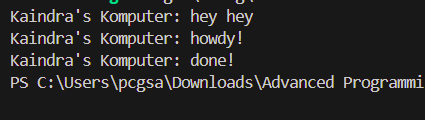

# Module 10 - Asynchronous Programming

## Tutorial 1 - Timer

### 1.2 Understanding how it works

Output muncul dengan urutan "hey hey" --> "howdy!" --> "done!" karena `println!("hey hey")` dijalankan sebelum `executor.run()`, sehingga dieksekusi lebih dulu. Task async yang dijadwalkan dengan `spawn` baru diproses saat executor dijalankan, mencetak `howdy!`, menunggu secara async, lalu mencetak `done!` setelah timer selesai.
