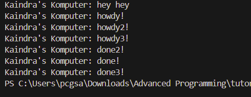

# Module 10 - Asynchronous Programming

## Tutorial 1 - Timer

### 1.2 Understanding how it works

Output muncul dengan urutan "hey hey" --> "howdy!" --> "done!" karena `println!("hey hey")` dijalankan sebelum `executor.run()`, sehingga dieksekusi lebih dulu. Task async yang dijadwalkan dengan `spawn` baru diproses saat executor dijalankan, mencetak `howdy!`, menunggu secara async, lalu mencetak `done!` setelah timer selesai.

### 1.3. Multiple Spawn and removing drop

Dengan `drop(spawner)`

Pada gambar ini, hasil dari multiple spawn menunjukkan bahwa semua task async (howdy!, howdy2!, howdy3!) berhasil dijadwalkan dan dieksekusi oleh executor, namun urutan output done! tidak berurutan sesuai dengan spawn. Ini terjadi karena semua task dimulai hampir bersamaan, lalu masing-masing await pada TimerFuture yang memiliki durasi sama (2 detik), membuat penyelesaiannya bergantung pada urutan polling dan re-scheduling oleh executor. Karena executor hanya menggunakan satu thread dan memproses task secara bergantian (interleaved), maka hasil done! muncul berdasarkan kapan masing-masing task di-wake dan diproses kembali, bukan berdasarkan urutan spawn-nya.

Tanpa `drop(spawner)`

Tanpa drop(spawner), channel tetap terbuka sehingga executor.run() tidak pernah keluar dari loop recv() meskipun semua task sudah selesai, karena recv() akan terus menunggu task baru tanpa batas. Akibatnya, executor tidak akan pernah tertutup secara otomatis, dan program akan tetap berjalan dalam keadaan menunggu meskipun tidak ada lagi task yang harus dieksekusi.